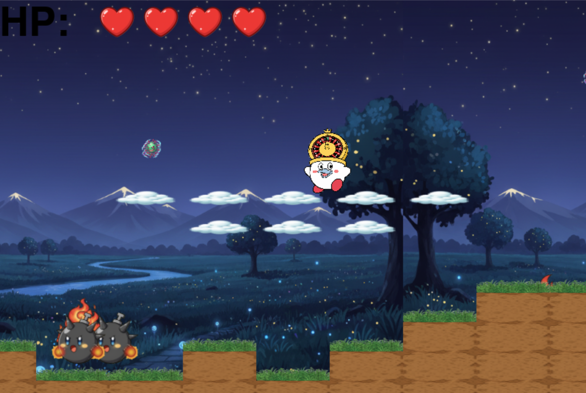

# 星のこうかとん

## 実行環境の必要条件
* python >= 3.10
* pygame >= 2.1

## ゲームの概要
* こうかとんを操作し、敵を避け・倒しながらゴールを目指せ！！

## ゲームの遊び方
* 矢印キーで移動、スペースキーでジャンプ、Aで吸収
* ファイア状態のとき: zでファイアボール、xでファイアブレス、cでクラッシュ
* ボム状態のとき: bでボム配置(自動爆破)、 shift+bでボム投げる、 kでボム蹴る
* カジノ状態のとき: 0でランダムな大きさのチップを投擲
* こうかとんの体力が0になったら敗北

## ゲームの実装
### 共通基本機能
* 背景・地面ブロック・地表ブロック・浮島ブロックの描写
* ゴール、スコア、hpの配置
* 拡張幅に合わせたマップの自動生成, 敵のランダム配置
* ジャンプ(ホバリング)
* プレイヤー、敵の基本挙動
* スクロール機能
* 重力の設定、床・壁との衝突判定
* ステージギミック(上下するウイルス)

### 分担追加機能
* 小林：カジノをモチーフにした敵キャラを吸収した後の攻撃・動作など。
  見た目もカジノをモチーフにした姿を作成
  攻撃方法を作成、攻撃方法はランダムで攻撃のレベルが変わり稀に超強い攻撃が出る、ギャンブル要素を入れた

* C0A24223.不破太一
  爆弾の敵の追加： 
  その敵から攻撃手段である爆弾の投擲を追加  
  地面をすり抜けて落ちないように地面との当たり判定を追加  
  追加した内容  
  炎の敵・投擲物・投擲物の動き  
  スロットの敵・投擲物・投擲物の動き  
  追加した敵のブロックとの当たり判定  

* C0C24005:入江諒  
  カービィの攻撃アクションを3種類（ファイアボール、ファイアブレス、ファイアクラッシュ）実装し、それぞれZ/X/Cキーで発動できるようにした。  
  ファイアボールはバウンドする物理挙動を持ち、進行方向に飛んで一定時間で消えるようにした。  
  ファイアブレスは口元から連続して発射され、炎らしい見た目になるように画像やエフェクトを工夫した。  
  ファイアクラッシュは範囲攻撃エフェクトを追加し、クールタイムなしで何度でも発動できるようにした。  

* C0C24001  
  能力の所持状態を管理  
  爆弾敵を吸い込んだ時に呼び出される  
  能力を失った時に呼び出される  
  Bキー押下時に爆弾を生成（能力所持時のみ、重力で落下）  
  Shift+Bキーで爆弾投擲（能力所持時のみ、放物線軌道）  
  Kキー 近くの爆弾をキック  
  **物理演算機能**:  
  重力: GRAVITY * 0.5（通常の半分の重力）  
  跳ね返り: 壁や地面で減衰（係数: 0.3～0.5）  
  摩擦: 地面での減速処理（係数: 0.9）  
  衝突判定: ブロックとの詳細な物理衝突  
  **爆発システム**:  
  導火線時間: 3.0秒（設置から爆発まで）  
  爆発範囲: タイルサイズの3倍（半径120px）  
  爆発エフェクト表示時間: 0.5秒  

* C0A24235 松永琉誠  
  吸収機能・ホバリング・ジャンプエフェクト・マップの拡張とランダム生成の用意、及びリファクタリング  
  aキーを押すとプレイヤーの向いてる方向にに竜巻が出現  
  竜巻に触れた敵を吸収、敵の種類に応じて変身  
  吸収中の敵のサイズを縮小  
  ジャンプを5回まで可能に変更・その際プレイヤーの左右にジャンプエフェクトを出現  
  拡張幅までマップを拡張する機能を実装。地中ブロック・地表ブロック・浮島ブロックを配置・描写  

### ToDo
- [ ] ドックストリングや型ヒントの設定
- [ ] スクロール機能の実装
- [ ] プレイヤーや地形を画像に変更
- [ ] ホバリング機能の実装
 
### メモ
* 定数は大文字英数字「例:PLAYER_SPEED」,クラス名はキャメルケース「例:PlayerAttack」,関数名・変数はスネークケース「例:player_speed」 
* 関数について、仮引数には型ヒントをつけること,関数アノテーション(例の右端のやつ)をつけること, ドックストリングをつけること「例: def extend_stage(stage_width: "int") -> None: """ 引数: マップの・・・ """」
* コメントは#から1マス開けるといいよ「例: num # 敵の数」

* 今上がってる候補「カービィ」「シューティング(こうかとん)」
* 第一候補「カービィ」
* １: 横スクロールのゲーム。地面と敵を配置し、ゴールを目指す。
* 2:敵 こうかとん(イラスト)を配置、カービィっぽいやつを主人公に
* 3: 必須機能(横スクロール、地形判定、重力、ジャンプ) 特定機能(敵吸込、ホバリング)、追加機能(能力(※コードが大きく異なるような物: ファイアー、ボム、クラッシュ、スロット))
* 3-1:具体的実装方法 変身時、変身前カービィを消し、新たに返信スタンス
* ジャンル「シューティング」「パズル」「賭け事」

* 基本機能: １.スコア(優先度?,難易度1) 2.HP(優先度3,難易度1~2) 3.地形(優先度3,難易度?) 4.ゴール(優先度3,難易度1) 5.ホバリング(優先度1,難易度) 7.BGM(優先度1,難易度1) 9.敵(挙動も) 10.画像(敵、ゴール、背景)　11.廃棄
* 追加機能: 敵の行動